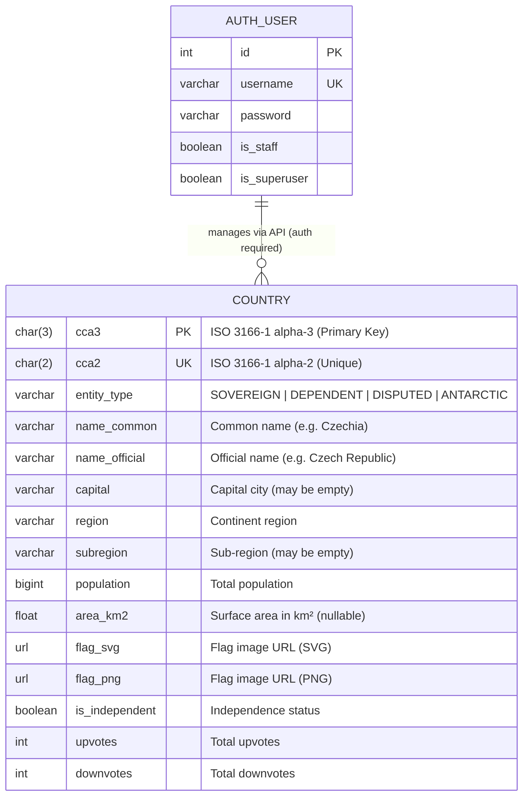
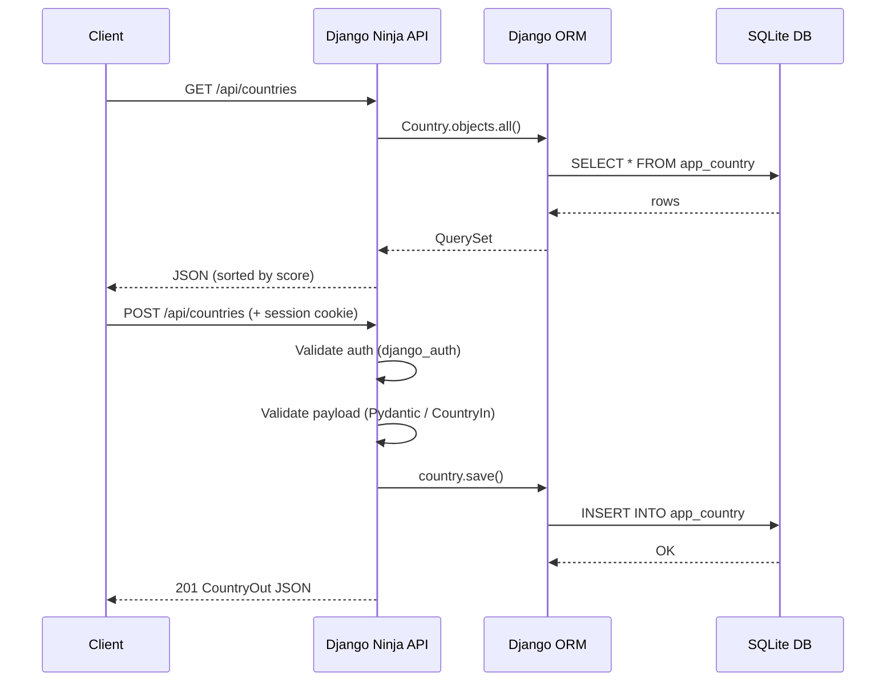

# 🏳️ Just Enough Flags (JEF)

A full-stack web application for browsing, rating, and managing world country flags. Built with **Django 6** on the backend and **Vue 3 + Vite** on the frontend, connected through a **Django Ninja** REST API.

---

## Table of Contents

- [Overview](#overview)
- [Tech Stack](#tech-stack)
- [Project Structure](#project-structure)
- [ER Diagram](#er-diagram)
- [Database Schema](#database-schema)
- [API Reference](#api-reference)
- [URL Routes](#url-routes)
- [Setup & Installation](#setup--installation)
- [Data Pipeline](#data-pipeline)
- [Admin Panel](#admin-panel)

---

## Overview

**Just Enough Flags** is a country/flag database application that lets users:

- Browse all world countries and their flags in a responsive card grid
- Rate countries via upvote/downvote (score system)
- Manage country records through a REST API and Django Admin panel
- Explore the API interactively via the built-in API playground

---

## Tech Stack

| Layer      | Technology                          |
|------------|-------------------------------------|
| Backend    | Django 6.0.5                        |
| API        | Django Ninja 1.6.2 (OpenAPI/REST)   |
| Validation | Pydantic 2.x                        |
| Database   | SQLite (via Django ORM)             |
| Frontend   | Vue 3.5 + Vite 8                    |
| Templating | Django Templates (HTML)             |

---

## Project Structure

```
django-prj-wt/
├── fixtures/                   # Django fixture data
│   ├── countries_raw.json      # Raw data fetched from mledoze/countries
│   └── countries.json          # Converted Django fixture
├── frontend/                   # Vue 3 + Vite SPA
│   └── src/
│       ├── App.vue
│       ├── components/
│       │   └── CountryList.vue # Fetches and renders country cards
│       └── style.css
├── prj/                        # Django project root
│   ├── manage.py
│   ├── db.sqlite3
│   ├── fetch_countries.py      # Script: download raw country data
│   ├── app/                    # Main Django application
│   │   ├── models.py           # Country model
│   │   ├── api.py              # Django Ninja REST API
│   │   ├── views.py            # Template-based views
│   │   ├── admin.py            # Admin panel configuration
│   │   ├── urls.py             # App-level URL patterns
│   │   └── templates/
│   │       ├── base.html
│   │       ├── home.html
│   │       ├── flags.html
│   │       └── api_playground.html
│   └── prj/                    # Django configuration
│       ├── settings.py
│       └── urls.py
├── generate_fixtures.py        # Script: convert raw JSON → Django fixture
└── requirements.txt
```

---

## ER Diagram

The application currently has a single core entity — `Country` — plus the built-in Django auth tables (used for API authentication).



> **Note:** `score` is a computed property (`upvotes - downvotes`) — it is **not** a stored column.

---

## Database Schema

### `Country` Model (`app_country` table)

| Field           | Type           | Constraints              | Description                                       |
|-----------------|----------------|--------------------------|---------------------------------------------------|
| `cca3`          | `CharField(3)` | **Primary Key**          | ISO 3166-1 alpha-3 code (e.g. `CZE`, `USA`)      |
| `cca2`          | `CharField(2)` | Unique                   | ISO 3166-1 alpha-2 code (e.g. `CZ`, `US`)        |
| `entity_type`   | `CharField(20)`| Choices, default=SOVEREIGN | Country classification                          |
| `name_common`   | `CharField(150)`|                          | Common name (e.g. *Czechia*)                     |
| `name_official` | `CharField(200)`|                          | Official name (e.g. *Czech Republic*)            |
| `capital`       | `CharField(150)`| Blank allowed            | Capital city name                                 |
| `region`        | `CharField(100)`|                          | Geographic region (e.g. *Europe*)                |
| `subregion`     | `CharField(100)`| Blank allowed            | Geographic sub-region (e.g. *Central Europe*)    |
| `population`    | `BigIntegerField`|                         | Total population count                            |
| `area_km2`      | `FloatField`   | Null/blank allowed       | Area in km²                                      |
| `flag_svg`      | `URLField(500)`|                          | SVG flag URL (from flagcdn.com)                  |
| `flag_png`      | `URLField(500)`|                          | PNG flag URL (from flagcdn.com)                  |
| `is_independent`| `BooleanField` | Default: `True`          | Whether the entity is independent                |
| `upvotes`       | `IntegerField` | Default: `0`             | User upvote count                                |
| `downvotes`     | `IntegerField` | Default: `0`             | User downvote count                              |
| `score` *(computed)* | `@property` |                       | `upvotes - downvotes` — used for frontend ranking|

**Default ordering:** `name_common` (A → Z)

---

## API Reference

The REST API is built with **Django Ninja** and served at `/api/`. Interactive docs are available at `/api/docs`.

### Authentication

Write operations (`POST`, `PUT`, `DELETE`) require Django session authentication (`django_auth`). Read operations are public.

### Endpoints

| Method   | Endpoint                  | Auth Required | Description                          |
|----------|---------------------------|:-------------:|--------------------------------------|
| `GET`    | `/api/countries`          | ❌            | List all countries, sorted by score  |
| `GET`    | `/api/countries/{cca3}`   | ❌            | Get a single country by CCA3 code    |
| `POST`   | `/api/countries`          | ✅            | Create a new country entry           |
| `PUT`    | `/api/countries/{cca3}`   | ✅            | Update an existing country           |
| `DELETE` | `/api/countries/{cca3}`   | ✅            | Delete a country entry               |

### Request/Response Flow



---

## URL Routes

| URL Pattern     | View / Handler       | Name              | Description                         |
|-----------------|----------------------|-------------------|-------------------------------------|
| `/`             | `views.home`         | `home`            | Home page (Django template)         |
| `/flags/`       | `views.flags`        | `flags`           | Flag gallery (Django template)      |
| `/api/...`      | Django Ninja router  | —                 | REST API (all CRUD endpoints)       |
| `/api/docs`     | Ninja auto-docs      | —                 | OpenAPI / Swagger UI                |
| `/playground/`  | `views.api_playground`| `api_playground` | Interactive API testing page        |
| `/admin/`       | Django Admin         | —                 | Admin panel (staff only)            |

---

## Setup & Installation

### Prerequisites

- Python 3.11+
- Node.js 18+ (for the Vue frontend)

### Backend

```bash
# Clone the repository and enter the project
cd prj/

# Create and activate a virtual environment
python -m venv .venv
source .venv/bin/activate

# Install Python dependencies
pip install -r ../requirements.txt

# Apply database migrations
python manage.py migrate

# Create an admin superuser
python manage.py createsuperuser

# Start the Django development server
python manage.py runserver
```

### Frontend

```bash
cd frontend/

# Install Node dependencies
npm install

# Start the Vite dev server (proxies /api to Django)
npm run dev
```

> The Vue frontend dev server is configured to proxy `/api` requests to the Django backend on `localhost:8000`.

---

## Data Pipeline

Country data is sourced from the open [`mledoze/countries`](https://github.com/mledoze/countries) dataset and loaded via Django fixtures.


### Steps to populate the database

```bash
# 1. Fetch raw country data from the GitHub source
python prj/fetch_countries.py

# 2. Convert to Django fixture format
python generate_fixtures.py

# 3. Load the fixture into the database
cd prj/
python manage.py loaddata ../fixtures/countries.json
```

> **Note:** `entity_type` and `is_independent` flags are set based on the source data. Historical countries (e.g. Yugoslavia) are marked accordingly, and territories like Gibraltar are classified as `DEPENDENT`.

---

## Admin Panel

The Django Admin is available at `/admin/` and provides a rich interface for managing countries.

**Features:**
- Flag thumbnail preview in the list view
- Sidebar filters by `region` and `is_independent`
- Full-text search across `name_common`, `name_official`, `cca3`, `cca2`, and `capital`
- Organised edit form with sections: *Identification*, *Geography*, *Visual Media*, *Politics*, *Statistics*

**Admin header:** `JEF Databáze Administrace`