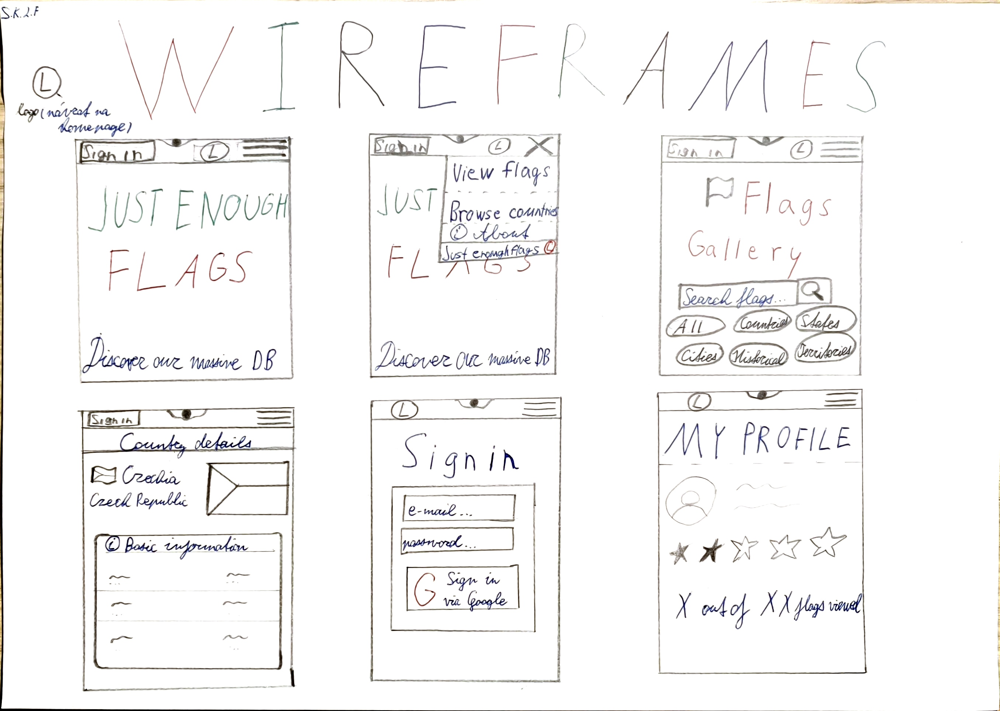
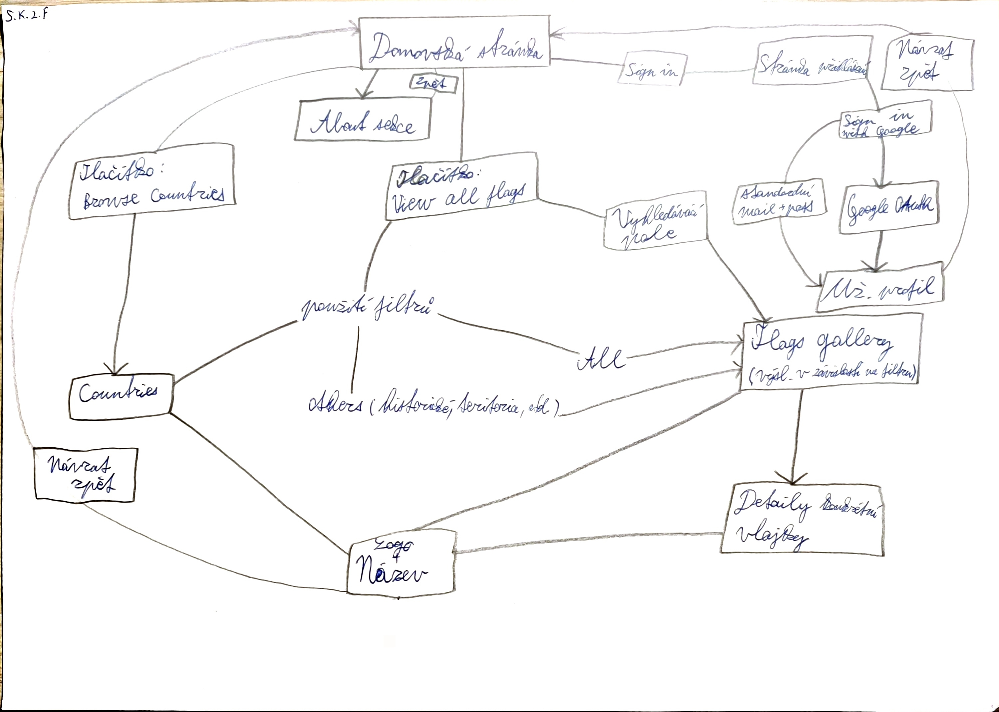
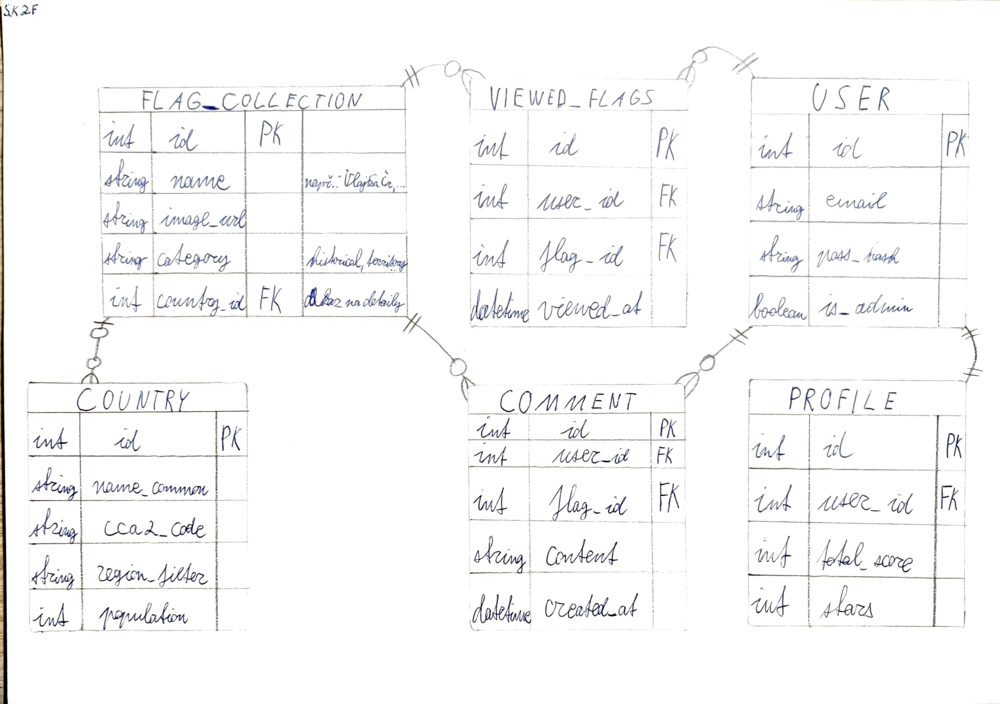

# 🌍 Just Enough Flags

A database-driven geography and flags web application built with Django. Browse **4,600+ flags** from countries, historical states, international organizations, territories, cities and regions — all sourced live from [Wikidata](https://www.wikidata.org/).

---

## Odborný článek
Projekt Just Enough Flags představuje moderní webovou <ins>aplikaci</ins>, která slouží jako komplexní <ins>databáze</ins> světových <ins>států</ins> a jejich <ins>vlajek</ins>. Z pohledu <ins>vexilologie</ins> a <ins>geografie</ins> platforma agreguje klíčová <ins>data</ins>, mezi něž patří <ins>hlavní město</ins>, celková <ins>populace</ins>, <ins>rozloha</ins> a příslušný <ins>kontinent</ins> či geografický <ins>region</ins>. Systém je navržen tak, aby efektivně obsluhoval různé typy interakcí prostřednictvím striktního oddělení přístupových práv.

Základní úrovní v systému je anonymní <ins>návštěvník</ins>. Tento typ přístupu umožňuje volné prohlížení veřejného <ins>obsahu</ins>, vyhledávání specifických <ins>entit</ins> a používání <ins>filtrů</ins> v <ins>galerii</ins>. Návštěvník si může zobrazit detailní <ins>informace</ins> o konkrétní <ins>zemi</ins>, ale nemá možnost do systému nijak zasahovat ani zanechávat trvalou stopu.

Druhou, podstatně rozšířenou rolí, je registrovaný <ins>uživatel</ins>. <ins>Autentizace</ins> do <ins>účtu</ins> je řešena moderními přístupy – buď standardní kombinací e-mailu a <ins>hesla</ins>, nebo prostřednictvím <ins>protokolu</ins> Google OAuth, což výrazně usnadňuje proces registrace. Po úspěšném přihlášení získává uživatel přístup ke svému <ins>profilu</ins>, který obsahuje prvky <ins>gamifikace</ins>. Hlavním motivačním prvkem je vizuální <ins>ukazatel</ins> v podobě <ins>hvězdiček</ins> (v maximálním počtu pět), který reflektuje <ins>počet</ins> zhlédnutých (rozkliknutých) vlajek. Čím více států uživatel prozkoumá, tím vyšší <ins>skóre</ins> na profilu má. Tato role je navíc jako jediná oprávněna k interakci s komunitou, což zahrnuje udělování <ins>hodnocení</ins> a psaní <ins>komentářů</ins> k jednotlivým vexilologickým symbolům.

Nejvyšší privilegia v <ins>hierarchii</ins> drží <ins>administrátor</ins>. Jeho hlavní odpovědností je <ins>správa</ins> celého <ins>katalogu</ins>. Má <ins>přístup</ins> do administračního <ins>rozhraní</ins>, kde může přidávat nové záznamy, upravovat existující demografické <ins>statistiky</ins> a spravovat uživatelské účty.

Tato <ins>architektura</ins> zajižduje, že projekt je otevřený pro širokou veřejnost, ale zároveň poskytuje bezpečný a interaktivní prostor pro aktivní objevovatele.

### Wireframes


### User Flow Diagram


### Entity-relationship diagram


## ✨ Features

| Feature | Details |
|---|---|
| 🏳️ **Flag gallery** | 4,600+ flags with click-to-zoom lightbox |
| 🌐 **Countries** | 195 sovereign states (UN members + Kosovo/Vatican) |
| 📜 **Historical flags** | Nazi Germany, Ottoman Empire, Soviet Union, GDR and 900+ more |
| 🤝 **International orgs** | EU, NATO, UN, African Union and 50+ more |
| 🏝️ **Territories** | 80 major and minor territories (Guam, Greenland, etc.) |
| 🔍 **Smart search** | DRY-compliant, accent-insensitive search logic |
| 📑 **Pagination** | 60 flags/page, optimized data fetching |
| 📱 **Responsive** | Bootstrap 5, works on all screen sizes |
| ⚡ **Fast** | Lazy-loaded images and specialized Django views |

---

## 🚀 Quick Start

```bash
# 1. Clone / enter project
cd 2025_wt_prj_khudanych

# 2. Create and activate virtual environment
python -m venv venv
source venv/bin/activate        # Windows: venv\Scripts\activate

# 3. Install dependencies
pip install -r requirements.txt

# 4. Apply database migrations
cd prj
python manage.py migrate

# 5. Populate data from Wikidata (requires internet, ~5 min)
python manage.py populate_wikidata   # Phase 1: 195 states + 54 major territories
python manage.py populate_extra      # Phase 2: Historical / international / extra flags

# 6. Start the server
python manage.py runserver
```

---

## 🗄️ Architecture & DRY

The project follows the **DRY (Don't Repeat Yourself)** principle by using a centralized normalization and pagination helper in `views.py`:

```python
def _normalize_and_paginate(items_list, request, per_page):
    # Centralized search & pagination logic
```

This ensures that search behavior, accent-insensitivity, and pagination are consistent across the Countries browser, Territories list, Historical gallery, and the main Flags Gallery.

---

_Autor: Serhii Khudanych — Třída: 2.F_
